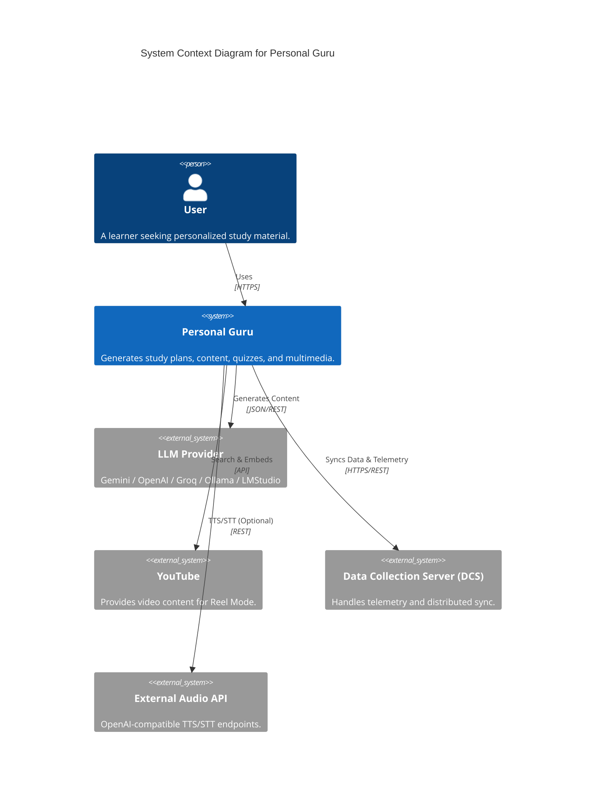
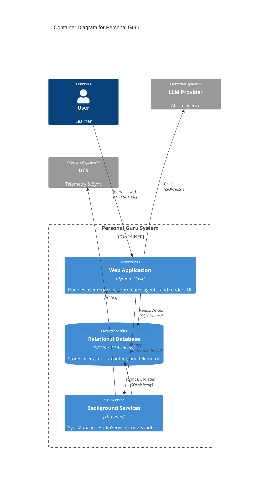
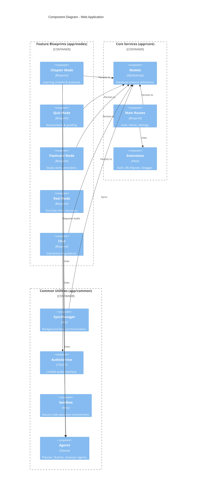
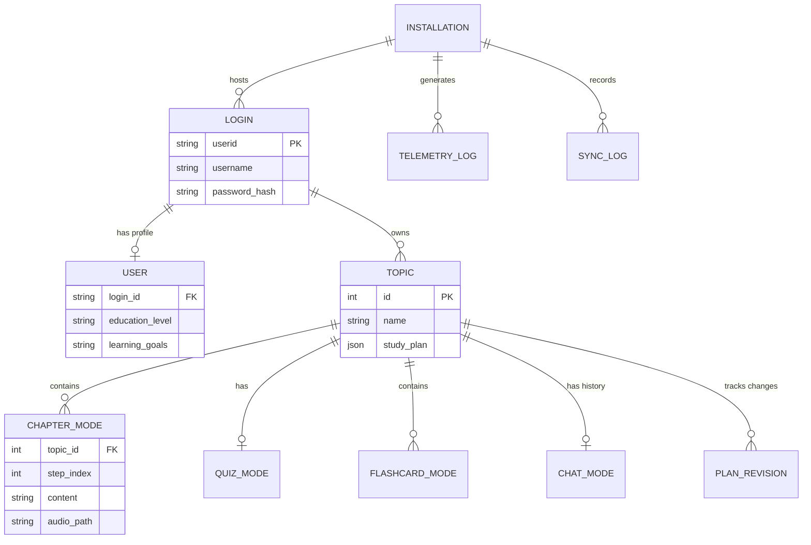
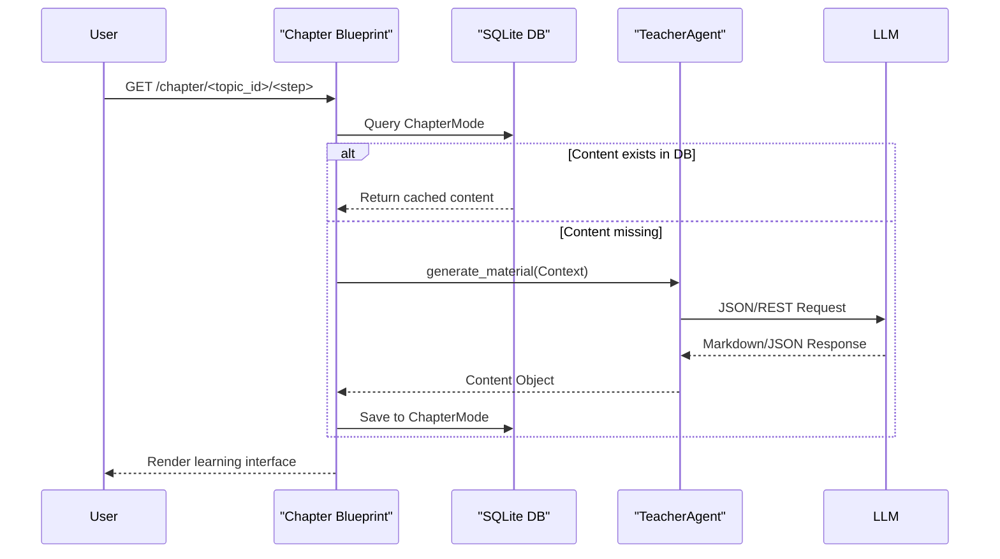
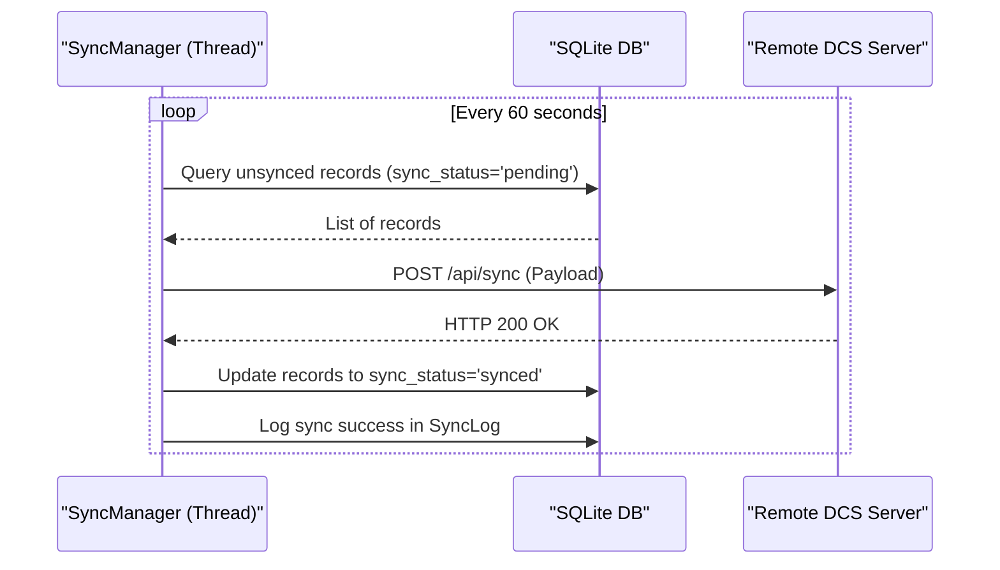

# Software Architecture

This document describes the high-level architecture of the Personal Guru application using the C4 model.

## 1. System Context Diagram (Level 1)

Personal Guru provides a personalized learning experience by orchestrating multiple AI services and local processing.

## 2. Container Diagram (Level 2)

The system consists of a Flask web application, a relational database, and several background services.

## 3. Component Diagram (Level 3)

The Web Application is organized into modular Blueprints and Core services.

## 4. Data Model (Entity Relationship Diagram)

Personal Guru uses a structured relational model to track learning progress and application state.

## 5. Dynamic Views (Sequence Diagrams)

### 5.1 Study Step Loading & Generation

Previously, the system relied on JSON files. Now, it uses a database-first approach with lazy generation of AI content.

### 5.2 Background Data Synchronization

